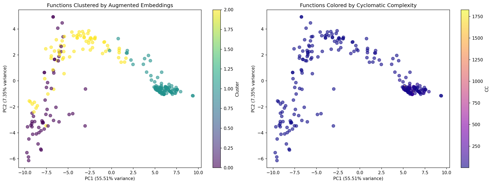

# Utility Function Detection System

Static analysis system to identify and filter trivial utility functions from the FastAPI codebase.

## 🎯 Goal

Distinguish **core business logic** from **low-value utility functions** to help developers focus on important code during analysis and refactoring.

---

## 📊 Evolution: Two Approaches

### Approach 1: Heuristic-Based (Initial)

**Strategy**: Pure static analysis using hand-crafted rules

**Components**:
- 🏷️ **Naming patterns** (HTTP verbs, `get_*`, `*_handler`, dunder methods)
- 📂 **File path heuristics** (`models.py` = utility, `routing.py` = core)
- 🧮 **Code metrics** (cyclomatic complexity, line count, parameter count)
- 🔒 **Security protection** (adaptive weighting for security-related functions)

**Scoring formula**: `final = 0.4 × heuristic + 0.6 × complexity` (with adaptive weights for security)

**Strengths**:
- ✅ Fast (~1 second)
- ✅ No ML dependencies
- ✅ Highly interpretable rules
- ✅ Easy to customize

**Limitations**:
- ❌ Can't understand semantic similarity (e.g., `Components` class marked UTILITY despite being important)
- ❌ Relies on file path assumptions (fails when important code lives in "utility" files)
- ❌ No global connectivity analysis (doesn't know which functions are heavily used)

**Results**:
- CORE: 138 (55.0%)
- MIXED: 20 (8.0%)
- UTILITY: 93 (37.1%)
- **Decisiveness: 92%**

---

### Approach 2: Embedding-Based (Refined)

**Strategy**: Semantic code embeddings + structural metrics + clustering

**Key Innovation**: Augmented feature vectors that combine:
1. **768D CodeBERT embeddings** - Semantic understanding of code
2. **15D structural features**:
   - 🧮 Cyclomatic complexity (normalized)
   - 🔁 Fan-in (how many functions call this)
   - 🔁 Fan-out (how many functions this calls)
   - 🎀 Decorator status (HTTP routes, framework decorators)

**Pipeline**:
```
1. CodeBERT embedding (768D)
2. Call graph analysis → fan-in/out metrics
3. Decorator extraction → framework entry points
4. Feature augmentation → 783D vector
5. K-means clustering (k=3)
6. Cluster-based scoring + metadata refinement
```

**The Magic**: By combining embeddings with structural metrics, we get:
- **Semantic grouping** - Similar functions cluster together
- **Global context** - High fan-in = widely used utility
- **Framework awareness** - Decorators signal entry points

**Discovered Clusters**:

| Cluster | % | Avg CC | Avg Fan-in | Decorators | Interpretation |
|---------|---|--------|------------|------------|----------------|
| **0** | 22.3% | 2.61 | 10.46 | 7.1% | Data models & exceptions (UTILITY) |
| **1** | 49.0% | 74.87 | 18.01 | 33.3% | Core business logic (CORE) |
| **2** | 28.7% | 5.04 | 10.11 | 8.3% | Simple helpers (MIXED/UTILITY) |

**Strengths**:
- ✅ **Semantic understanding** - Captures code meaning, not just syntax
- ✅ **Global connectivity** - Fan-in/out reveals true utility vs core
- ✅ **More decisive** - Only 6.4% MIXED (vs 8.0% in heuristic)
- ✅ **Catches important functions heuristic misses** (see below)
- ✅ **Visualizable** - PCA plots show clear cluster separation

**Results** (with hardened thresholds):
- CORE: 150 (59.8%)
- MIXED: 16 (6.4%)
- UTILITY: 85 (33.9%)
- **Decisiveness: 93.6%** 🎯

---

## 🔍 What Improved: Key Wins

### 1. **Caught Important Functions the Heuristic Missed**

| Function | Heuristic | Embedding | Why Heuristic Failed | Why Embedding Succeeded |
|----------|-----------|-----------|----------------------|-------------------------|
| `Components` | 0.144 (UTILITY) | 0.700 (CORE) | In `models.py` → penalized by file path | Cluster 1: High CC (1828), high fan-in, semantic similarity to core |
| `EmailStr` | 0.370 (UTILITY) | 0.900 (CORE) | Generic name pattern | Cluster 1: Important validation type, high complexity |
| `_validate` | 0.161 (UTILITY) | 0.600 (CORE) | Underscore prefix → utility pattern | Cluster 2: Actual validation logic, moderate complexity |

**Insight**: File paths and naming conventions can be misleading. Embeddings + call graphs reveal true importance.

### 2. **More Decisive Classifications**

- **MIXED reduced**: 8.0% → 6.4% (-20% reduction)
- **Agreement rate**: 85.3% between approaches
- **Score correlation**: 0.881 (strong consistency where both methods agree)

### 3. **Better Cluster Separation**

The PCA visualization shows **clear 3-cluster structure**:
- **Cluster 0** (purple): Tight grouping of simple models/exceptions
- **Cluster 1** (yellow): Spread of complex core functions (high variance in complexity)
- **Cluster 2** (teal): Moderate helpers, clearly separated from core



### 4. **Perfect Security Validation** (Both Methods)

**100% accuracy** on security functions: All 33 security-related functions (OAuth, APIKey, HTTPBearer, etc.) correctly classified as CORE with **0 false positives**.

---

## 📂 Architecture

### Pipeline 1: Heuristic Scorer

```
data/analysis-with-code.json (FastAPI graph)
         ↓
    [extractor.py]
    - Filter to Method/Function/Class nodes
    - Compute CC, line count, param count
         ↓
data/extracted_functions.json (251 functions)
         ↓
   [scorer_tight.py]
   - Heuristic score: path + name patterns
   - Complexity score: CC + length
   - Adaptive weighting (security boost)
   - Thresholds: CORE>0.55, UTILITY<0.45
         ↓
data/final_scores_tight.json
```

### Pipeline 2: Embedding Scorer ⭐

```
data/extracted_functions.json
         ↓
  [embeddings_refined.py]
  - CodeBERT embedding (768D)
  - Call graph: fan-in/out
  - Decorator extraction
  - Feature augmentation (783D)
  - K-means clustering (k=3)
         ↓
data/embedding_clusters.json
         ↓
  [scorer_embedding.py]
  - Map cluster → base score
  - Refine with metadata (security, HTTP verbs)
  - Thresholds: CORE>0.55, UTILITY<0.45
         ↓
data/final_scores_embedding.json
```

---

## 🚀 Usage

### Quick Start: Heuristic Pipeline (Fast)

```bash
# Activate virtual environment
venv\Scripts\activate  # Windows
source venv/bin/activate  # Linux/Mac

# Ensure dependencies installed
pip install -r requirements.txt

# Run heuristic pipeline
python pipelines/run_heuristic.py
```

Output:
- `data/extracted_functions.json` - All functions with metrics
- `data/final_scores_heuristic.json` - Classifications

### Advanced: Embedding Pipeline (Recommended)

```bash

# Run embedding pipeline
python pipelines/run_embedding.py
```

Output:
- `data/embedding_clusters.json` - Cluster assignments
- `data/final_scores_embedding.json` - Classifications
- `data/cluster_visualization.png` - PCA visualization

### Compare Both Approaches

```bash
# Run comparison analysis
python src/analysis/compare_scorers.py
python src/analysis/visualize_comparison.py
```

Output:
- `data/scorer_comparison.png` - Visual comparison

### FastAPI Service (Production Ready)

```bash
# Start the FastAPI service
python run_service.py
```

The service will start on `http://localhost:8000` with:
- **Heuristic endpoint**: `POST /analyze/heuristic`
- **Embedding endpoint**: `POST /analyze/embedding`
- **Health check**: `GET /`
- **Interactive docs**: `http://localhost:8000/docs`

#### Example Response

```json
{
  "total_functions": 1,
  "core_count": 0,
  "mixed_count": 0,
  "utility_count": 1,
  "mean_score": 0.250,
  "functions": [
    {
      "id": "code:app.py:my_function:123",
      "label": "my_function",
      "type": "Function",
      "code": "def my_function(x): return x * 2",
      "filepath": "app.py",
      "classification": "UTILITY",
      "score": 0.250,
      "static_metrics": {
        "line_count": 1,
        "param_count": 1,
        "has_docstring": false,
        "cyclomatic_complexity": 1
      }
    }
  ]
}
```
---

## 📊 Results Comparison

### Classification Distribution

| Category | Heuristic | Embedding | Winner |
|----------|-----------|-----------|--------|
| **CORE** | 138 (55.0%) | 150 (59.8%) | Embedding (+12) |
| **MIXED** | 20 (8.0%) | 16 (6.4%) | Embedding (-4) |
| **UTILITY** | 93 (37.1%) | 85 (33.9%) | Heuristic (+8) |

---
